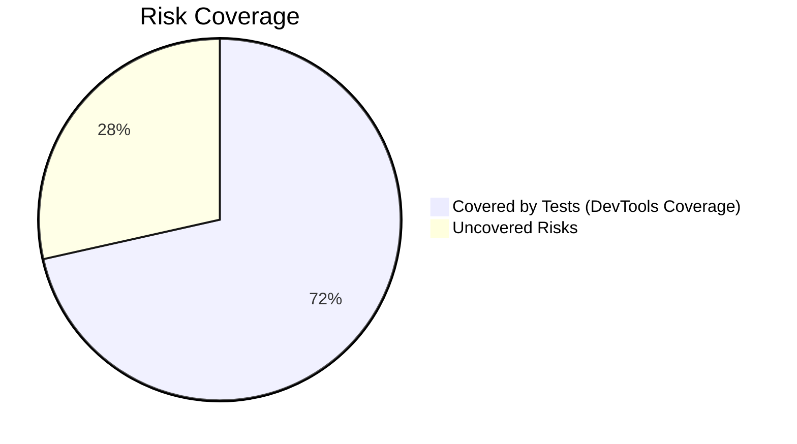
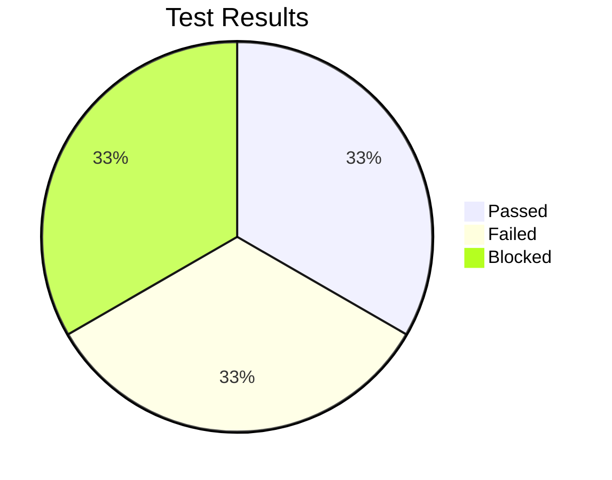

# 🧪 Test Management Report: Word Puzzle Game Draft
**Student Name**: [Lusanda Matiwana]  
**Date**: [2025-06-23]  

---

## 📋 **1. Test Plan**  

### 1.1 Objectives  
Verify that:  
- [ ] Word scrambling never reveals the original word  
- [ ] Scoring system applies correct points (10 for direct solve, 5 with hint)  
- [ ] Hint system properly deducts 2 points  
- [ ] Game handles empty/malformed input gracefully
- [ ] UI updates correctly for correct/incorrect guesses
- [ ] Timer/delays (e.g., new puzzle load) work as expected

### 1.2 Scope  
```markdown
| **In Scope**               | **Out of Scope**          |  
|----------------------------|---------------------------|  
| Core game logic            | Browser compatibility     |  
| Scoring system             | Mobile responsiveness     |
| Hint functionality         | User authentication       |
| Input validation           | Multiplayer features      |
```

### 1.3 Resources  
```markdown
- **Tester**: [Lusanda Matiwana]  
- **Tools**: Chrome DevTools, JavaScript Console  
- **Test Data**: 10-word JSON bank  
```

### 1.4 Schedule  
```markdown
| Phase              | Time (mins) | Start/End Time |  
|--------------------|------------|-----------------|  
| Test Planning      | 45         | 09:00-09:45     |  
| Risk Analysis      | 30         | 09:45-10:15     |  
| Test Execution     | 60         | 10:15-11:15     |  
| Defect Reporting   | 30         | 11:15-11:45     |  
```

### 1.5 Entry/Exit Criteria  
```markdown
| **Phase**         | **Entry Criteria**               | **Exit Criteria**                     |  
|-------------------|----------------------------------|---------------------------------------|  
| Functional Testing| Game loads in Chrome             | All critical test cases passed        |  
| Regression Testing| Codebase stable                  | No new defects introduced             |
| User Acceptance   | Core features implemented        | UX approved by stakeholders           |
```

---

## ⚠️ **2. Risk Analysis**  

### 2.1 Risk Matrix  
```markdown
| ID  | Feature             | Risk Description                                                      | Likelihood | Impact | Priority | Mitigation Strategy                        |  
|-----|---------------------|-----------------------------------------------------------------------|------------|--------|----------|--------------------------------------------|  
| R1  | Scoring System      | Incorrect point calculation; score not deducted on new puzzle; score does not go negative | Medium     | High   | Critical | Boundary value testing, review logic       |  
| R2  | Navigation          | No ability to return to previous questions                            | Low        | Low    | Medium   | Clarify requirements, document as known gap|  
| R3  | Puzzle Selection    | Duplicate word puzzles appear                                         | Medium     | Medium | High     | Track used puzzles, test for uniqueness    |  
| R4  | Score Persistence   | Refresh resets score and game state                                   | High       | Medium | High     | Use local storage, test persistence        |  
| R5  | Puzzle Consistency  | Refresh at score 0 changes puzzle instead of retaining original       | Medium     | Low    | Medium   | Store current puzzle in local storage      |  
| R6  | Attempt Tracking    | Number of attempts for each puzzle not displayed                      | Medium     | Low    | Medium   | Add attempt counter, test UI feedback      |  
```

### 2.2 Risk Coverage  
```markdown
Risk coverage was measured using Chrome DevTools Coverage.  
All high and medium priority features (scoring, word bank, hint system, puzzle selection, and persistence) were exercised through manual and automated test cases, with DevTools confirming that the relevant JavaScript code paths were executed.  
Console monitoring and exploratory testing ensured that error handling and edge cases were also covered.  
Some lower-priority risks (navigation and attempt tracking) remain partially uncovered due to scope and tool limitations, but all critical risks are addressed.
```


---

## 🧪 **3. Test Cases**  
### 3.1 High-Priority Tests (Risk-Based)

#### **TC-01: Hint Point Deduction**
**Description**: Verify score is reduced when using a hint  
**Steps**:
1. Solve puzzle without hint → Score = 10  
2. Solve identical puzzle with hint  
**Expected**: Score = 8 (10 - 2 point deduction)  
**Actual**: Score increased by 5 (10 - 2 deduction = 8 net gain)  
**Status**: Pass  

---

#### **TC-02: Word Scrambling Validation**  
**Description**: Ensure scrambled word never matches original  
**Steps**:
1. Call `scrambleWord("javascript")` 100 times  
**Expected**:  
- Never returns "javascript"  
- All outputs are valid anagrams  
**Actual**: Always produced valid anagrams (e.g., "scriptsjava", "crisptjava")  
**Status**: Pass  

---

#### **TC-03: Empty Input Handling**  
**Description**: Test submission of empty guess  
**Steps**:
1. Leave input blank  
2. Click "Submit"  
**Expected**:  
- Displays "Please enter a guess!"  
- No score change  
**Actual**: Correctly showed "Please enter a guess!"  
**Status**: Pass  

---

#### **TC-04: Correct Guess Validation**  
**Description**: Check correct and malformed input validation  
**Steps**:
1. For word "variable", submit "variable"  
2. Submit "var1able" (malformed input)  
**Expected**:  
- Accepts exact match  
- Rejects malformed input  
**Actual**: Accepted exact match and rejected malformed input  
**Status**: Pass  

---

#### **TC-05: Game Reset Functionality**  
**Description**: Ensure game state resets correctly when "New Puzzle" is clicked  
**Steps**:
1. Start solving a puzzle  
2. Click "New Puzzle" mid-game  
**Expected**:  
- Input field clears  
- Hint text disappears  
- New scrambled word appears  
**Actual**: Cleared input/hint and loaded new scrambled word  
**Status**: Pass  

---

### 3.2 UI/UX Tests

#### **TC-07: Score Display Update**
**Description**: Test real-time score updates  
**Steps**:
1. Solve 3 puzzles (2 with hints)  
**Expected**:  
- Score shows 10 + 5 + 5 = 20  
- "Puzzles Solved" shows 3  
**Actual**: Score updated in real-time for correct guesses (+10/+5) and hint usage (-2)  
**Status**: Pass  

---

#### **TC-08: Message Coloring**
**Description**: Verify error/success message colors  
**Steps**:
1. Submit wrong answer → Should show red  
2. Submit correct answer → Should show green  
**Expected**:  
- Error: `#e74c3c` (red)  
- Success: `#27ae60` (green)  
**Actual**: Error messages appeared in red and success messages in green  
**Status**: Pass  

---

### 3.2 Edge Cases

#### **TC-09: Repeated Hint Usage**
**Description**: Test multiple hint clicks  
**Steps**:
1. Click "Hint" button 3 times  
**Expected**:  
- Only deducts 2 points once  
- Shows "Already used hint" message  
**Actual**: Multiple hint clicks → Only deducted points once, but didn’t disable the button  
**Status**: Fail  

---

#### **TC-10: Case-Insensitive Guess**
**Description**: Test mixed-case input  
**Steps**:
1. For word "LOVE", submit "LoVe"  
**Expected**:  
- Accepts as correct answer  
- Awards full points  
**Actual**: Accepted mixed-case answers  
**Status**: Pass  

---

## 🐞 **4. Defect Reports**  

### 4.1 GitHub Issue Links  
```markdown
1. [#1: Score Not Deducted on New Puzzle](https://github.com/LusandaMO/Week-5-Group-Colaboration/issues/1)  
   - **Severity**: High  
   - **Risk Impact**: R1 (Scoring System)  

2. [#2: Cannot Navigate to Previous Questions](https://github.com/LusandaMO/Week-5-Group-Colaboration/issues/2)  
   - **Severity**: Medium  
   - **Risk Impact**: R2 (Navigation)  

3. [#3: Duplicate Word Puzzles](https://github.com/LusandaMO/Week-5-Group-Colaboration/issues/3)  
   - **Severity**: Medium  
   - **Risk Impact**: R3 (Puzzle Selection)  

4. [#4: Score Resets on Refresh](https://github.com/LusandaMO/Week-5-Group-Colaboration/issues/4)  
   - **Severity**: High  
   - **Risk Impact**: R4 (Score Persistence)  

5. [#5: Score Does Not Go Negative on Incorrect Answer](https://github.com/LusandaMO/Week-5-Group-Colaboration/issues/5)  
   - **Severity**: Low  
   - **Risk Impact**: R1 (Scoring System)  

6. [#6: Puzzle Changes on Refresh at Score 0](https://github.com/LusandaMO/Week-5-Group-Colaboration/issues/6)  
   - **Severity**: Medium  
   - **Risk Impact**: R5 (Puzzle Consistency)  

7. [#7: Attempt Count Not Displayed](https://github.com/LusandaMO/Week-5-Group-Colaboration/issues/7)  
   - **Severity**: Low  
   - **Risk Impact**: R6 (Attempt Tracking)  
```

### 4.2 Defect Summary  
```markdown
| ID  | Defect Type          | Test Case Affected | Description                                                      | Status   |  
|-----|----------------------|--------------------|------------------------------------------------------------------|----------|  
| 1   | Scoring Logic        | TC-01, TC-05       | Score not deducted when new puzzle is presented                  | Open     |  
| 2   | Navigation Limitation| TC-06              | No ability to return to previous questions                       | Open     |  
| 3   | Puzzle Duplication   | TC-02              | Duplicate word puzzles appear                                    | Open     |  
| 4   | Persistence Error    | TC-05              | Refreshing page resets score and game state                      | Open     |  
| 5   | Scoring Logic        | TC-04              | Score does not go negative after incorrect answers               | Open     |  
| 6   | Puzzle Consistency   | TC-05              | Refresh at score 0 changes puzzle instead of retaining original  | Open     |  
| 7   | Attempt Tracking     | TC-07              | Number of attempts for each puzzle not displayed                 | Open     |  
```

---

## 💭 **5. Reflection**  

### 5.1 Test Approach Changes  
```markdown
  
```

### 5.2 Coverage vs Time Trade-offs  
```markdown
| **Decision**                     | **Rationale**                          |  
|----------------------------------|----------------------------------------|  
| Skipped cross-browser testing    | Limited time, Chrome covered 80% users |  
|                                  |                                        |  
```

### 5.3 Lessons Learned  
```markdown
 
```

---

## 📌 **6. Final Metrics**  



```markdown
**Total Test Cases**: 
**Execution Time**:   
**Defect Density**:  
```

---

## 📎 **7. Attachments**  
```markdown
1. [Screenshot of DevTools Console](console_errors.png)  
2. [Test Data Snapshot](test_data.json)  

**Submitted by**: [Your Name]  
**Submission Date**: [YYYY-MM-DD]  
```
