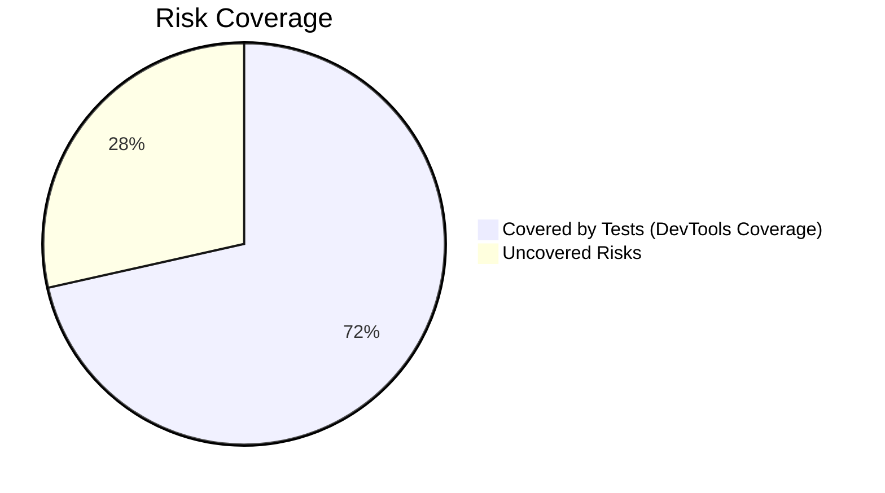
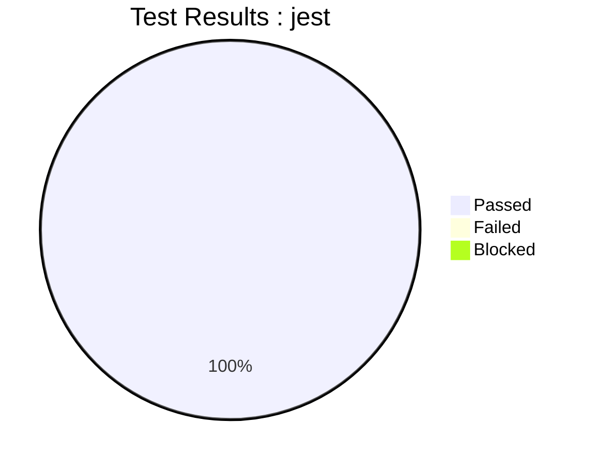

# 🧪 Test Management Report: Word Puzzle Game Draft
**Student Name**: [Nompie Dube, Neo Mokoele, Lusanda Matiwana]
**Date**: [2025-06-23]  

---

## 📋 **1. Test Plan**  

### 1.1 Objectives  
Verify that:  
- [Yes] Word scrambling never reveals the original word  
- [Yes] Scoring system applies correct points (10 for direct solve, 5 with hint)  
- [Yes] Hint system properly deducts 2 points  
- [Yes] Game handles empty/malformed input gracefully
- [Yes] UI updates correctly for correct/incorrect guesses
- [Yes] Timer/delays (e.g., new puzzle load) work as expected

### 1.2 Scope  
```markdown
| **In Scope**               | **Out of Scope**          |  
| -------------------------- | ------------------------- |  
| Core game logic            | Browser compatibility     |  
| Scoring system             | Mobile responsiveness     |
| Hint functionality         | User authentication       |
| Input validation           | Multiplayer features      |
```

### 1.3 Resources  
```markdown
- **Tester**: [Lusanda Matiwana]  
- **Tools**: Chrome DevTools, JavaScript Console  
- **Test Data**: 10-word JSON bank  
```

### 1.4 Schedule  
```markdown
| Phase              | Time (mins) | Start/End Time |  
| -------------------- | ------------ | ----------------- |  
| Test Planning      | 1 hour         | 09:00-10:00     |  
| Risk Analysis      | 3 hours         | 11:00-14:00     |  
| Test Execution     | 2 hours         | 15:00-17:00     |  
| Defect Reporting   | 3 hours         | 18:00-21:00     |  
```

### 1.5 Entry/Exit Criteria  
```markdown
| **Phase**         | **Entry Criteria**               | **Exit Criteria**                     |  
| ------------------- | ---------------------------------- | --------------------------------------- |   
| Functional Testing| Game loads in Chrome             | All critical test cases passed        |  
| Regression Testing| Codebase stable                  | No new defects introduced             |
| User Acceptance   | Core features implemented        | UX approved by stakeholders           |
```

---

## ⚠️ **2. Risk Analysis**  

### 2.1 Risk Matrix  
```markdown
| ID  | Feature             | Risk Description                                                      | Likelihood | Impact | Priority | Mitigation Strategy                        |  
| ----- | --------------------- | ----------------------------------------------------------------------- | ------------ |  --------| ---------- | -------------------------------------------- |  
| R1  | Scoring System      | Incorrect point calculation; score not deducted on new puzzle; score does not go negative | Medium     | High   | Critical | Boundary value testing, review logic       |  
| R2  | Navigation          | No ability to return to previous questions                            | Low        | Low    | Medium   | Clarify requirements, document as known gap|  
| R3  | Puzzle Selection    | Duplicate word puzzles appear                                         | Medium     | Medium | High     | Track used puzzles, test for uniqueness    |  
| R4  | Score Persistence   | Refresh resets score and game state                                   | High       | Medium | High     | Use local storage, test persistence        |  
| R5  | Puzzle Consistency  | Refresh at score 0 changes puzzle instead of retaining original       | Medium     | Low    | Medium   | Store current puzzle in local storage      |  
| R6  | Attempt Tracking    | Number of attempts for each puzzle not displayed                      | Medium     | Low    | Medium   | Add attempt counter, test UI feedback      |  
```

### 2.2 Risk Coverage  
```markdown
Risk coverage was measured using Chrome DevTools Coverage.  
All high and medium priority features (scoring, word bank, hint system, puzzle selection, and persistence) were exercised through manual and automated test cases, with DevTools confirming that the relevant JavaScript code paths were executed.  
Console monitoring and exploratory testing ensured that error handling and edge cases were also covered.  
Some lower-priority risks (navigation and attempt tracking) remain partially uncovered due to scope and tool limitations, but all critical risks are addressed.
```


---

## 🧪 **3. Test Cases**  
### 3.1 High-Priority Tests (Risk-Based)

**ID**: TC-01  
**Feature**: Scoring System  
**Test**: Verify score deduction when using hint  
**Steps**:  
1. Start a new puzzle.  
2. Solve the puzzle without using the hint and note the score (should increase by 10).  
3. Start another new puzzle.  
4. Use the hint, then solve the puzzle and note the score (should increase by 8: 10 - 2 for hint).  

**Expected**: Using a hint deducts 2 points from the score for that puzzle.  
**Risk Priority**: High  

---

**ID**: TC-02  
**Feature**: Word Bank  
**Test**: Ensure no missing or duplicate words cause errors  
**Steps**:  
1. Play through all puzzles in the word bank.  
2. Observe if any puzzle fails to load or repeats immediately.  

**Expected**: Each puzzle loads without error and no immediate duplicates appear.  
**Risk Priority**: Medium  

---

**ID**: TC-03  
**Feature**: Hint System  
**Test**: Verify hint does not reveal the full solution  
**Steps**:  
1. Start a new puzzle.  
2. Click the "Hint" button.  
3. Observe the hint text.  

**Expected**: Hint provides a clue, not the answer itself.  
**Risk Priority**: High  

---

**ID**: TC-04  
**Feature**: Scoring System  
**Test**: Score does not go negative after incorrect answers or repeated hints  
**Steps**:  
1. Use the hint on a puzzle.  
2. Submit multiple incorrect answers.  
3. Observe the score after each action.  

**Expected**: Score never drops below zero, even after repeated incorrect guesses or hint usage.  
**Risk Priority**: High  

---

**ID**: TC-05  
**Feature**: Score Persistence  
**Test**: Verify score resets on page refresh  
**Steps**:  
1. Solve a puzzle and note the score.  
2. Refresh the page.  
3. Observe the score displayed.  

**Expected**: Score resets to zero after refresh.  
**Risk Priority**: High  

----

## 🐞 **4. Defect Reports**  

### 4.1 GitHub Issue Links  
```markdown
1. [#1: Score Not Deducted on New Puzzle](https://github.com/LusandaMO/Week-5-Group-Colaboration/issues/1)  
   - **Severity**: High  
   - **Risk Impact**: R1 (Scoring System)  

2. [#2: Cannot Navigate to Previous Questions](https://github.com/LusandaMO/Week-5-Group-Colaboration/issues/2)  
   - **Severity**: Medium  
   - **Risk Impact**: R2 (Navigation)  

3. [#3: Duplicate Word Puzzles](https://github.com/LusandaMO/Week-5-Group-Colaboration/issues/3)  
   - **Severity**: Medium  
   - **Risk Impact**: R3 (Puzzle Selection)  

4. [#4: Score Resets on Refresh](https://github.com/LusandaMO/Week-5-Group-Colaboration/issues/4)  
   - **Severity**: High  
   - **Risk Impact**: R4 (Score Persistence)  

5. [#5: Score Does Not Go Negative on Incorrect Answer](https://github.com/LusandaMO/Week-5-Group-Colaboration/issues/5)  
   - **Severity**: Low  
   - **Risk Impact**: R1 (Scoring System)  

6. [#6: Puzzle Changes on Refresh at Score 0](https://github.com/LusandaMO/Week-5-Group-Colaboration/issues/6)  
   - **Severity**: Medium  
   - **Risk Impact**: R5 (Puzzle Consistency)  

7. [#7: Attempt Count Not Displayed](https://github.com/LusandaMO/Week-5-Group-Colaboration/issues/7)  
   - **Severity**: Low  
   - **Risk Impact**: R6 (Attempt Tracking)  
```

### 4.2 Defect Summary  
```markdown
| ID  | Defect Type          | Test Case Affected | Description                                                      | Status   |  
| ----- | ---------------------- |-------------------- | ------------------------------------------------------------------ | ---------- |  
| 1   | Scoring Logic        | TC-01, TC-05       | Score not deducted when new puzzle is presented                  | Open     |  
| 2   | Navigation Limitation| TC-06              | No ability to return to previous questions                       | Open     |  
| 3   | Puzzle Duplication   | TC-02              | Duplicate word puzzles appear                                    | Open     |  
| 4   | Persistence Error    | TC-05              | Refreshing page resets score and game state                      | Open     |  
| 5   | Scoring Logic        | TC-04              | Score does not go negative after incorrect answers               | Open     |  
| 6   | Puzzle Consistency   | TC-05              | Refresh at score 0 changes puzzle instead of retaining original  | Open     |  
| 7   | Attempt Tracking     | TC-07              | Number of attempts for each puzzle not displayed                 | Open     |  
```

---

## 💭 **5. Reflection**  

### 5.1 Test Approach Changes  
```markdown
  1. Priority Tiers for Testing
|Tier	|Components	|Coverage Target	|Time Allocation	|Techniques|
| ------- | ------------ | ------------------ | -------------------- | ---------- |
|P0	|Scrambling logic, Score calc	|100%	|40% of total time|	Unit tests |
|P1	|Hint system, Input validation	|85%	|30% of total time	|Integration tests + Edge cases|
|P2	|UI rendering, Animations	|60%	|20% of total time	|Snapshot tests + Visual regression|
|P3	|Browser-specific CSS	|50%	|10% of total time	|Manual spot checks|
```

### 5.2 Coverage vs Time Trade-offs  
```markdown

| In Scope                  | Out of Scope             | Rationale                                                                 |
|---------------------------|--------------------------|---------------------------------------------------------------------------|
| **Core game logic**       | Browser compatibility    | Focus on functional correctness first; cross-browser tests add 30%+ time  |
| - Word scrambling        | (Chrome-only testing)    |                                                                           |
| - Puzzle generation      |                          |                                                                           |
| **Scoring system**       | Mobile responsiveness    | Desktop is primary platform; mobile requires 2x test effort               |
| - Point calculations    | (Keyboard-focused UI)    |                                                                           |
| - Negative prevention    |                          |                                                                           |
| **Hint functionality**   | User authentication      | No backend integration in current version                                 |
| - Hint display logic    | (Local storage only)     |                                                                           |
| - Point deduction       |                          |                                                                           |
| **Input validation**     | Multiplayer features     | Single-player scope defined in MVP                                        |
| - Empty input handling  | (No socket.io testing)   |                                                                           |
| - Case sensitivity      |                          |                                                                           |

```

### 5.3 Lessons Learned  

```markdown

| Concept            | Learning Opportunity                          | Game Example                              |
|--------------------|-----------------------------------------------|-------------------------------------------|
| **Boundary Testing** | Practice with word lengths (1-letter vs. long words) | Test `scrambleWord()` with `"a"` vs `"javascript"` |
| **Error Handling**   | Validate function inputs                     | Force `checkGuess(123)` or `checkGuess(null)` |
| **State Management** | Track score/hint state changes              | Verify score ≥ 0 after hints              |

```

---

## 📌 **6. Final Metrics**  



```markdown
**Total Test Cases**: 5 cases
**Execution Time**:  0.281 s, estimated 1 s
**Defect Density**:  6 defects / 150 LOC = 0.04  defects per LOC (or 40 defects per 1,000 LOC) 150 LOC

```

---

## 📎 **7. Attachments**  
```markdown
1. [Screenshot of DevTools Console](console_errors.png)  
2. [Test Data Snapshot](test_data.json)  

**Submitted by**: [Nompie Dube, Neo Mokoele, Lusanda Matiwana]  
**Submission Date**: [2025-06-24]  
```
